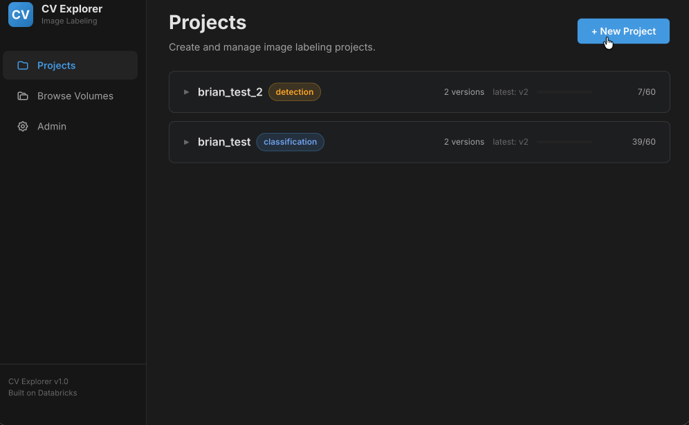
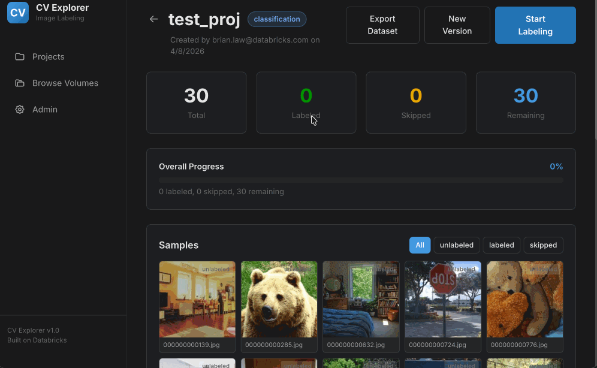
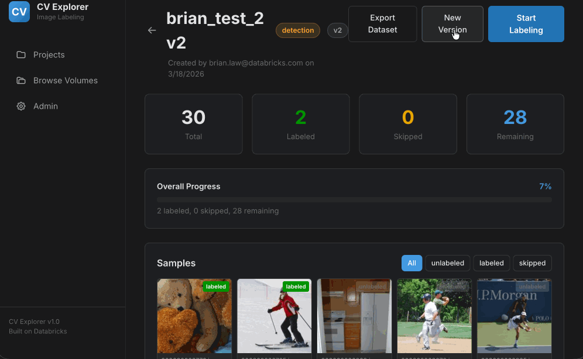

# CV Explorer — Image Labeling App

A React + FastAPI image annotation tool for **Databricks Apps**. Supports classification and bounding-box detection labeling, with project versioning, dataset export, and a Databricks dark-themed UI.

Built on **Lakebase** (managed PostgreSQL) for persistent storage with automatic Lakehouse Sync to Delta tables. Images are served from Unity Catalog Volumes.

## Features

- **Two labeling modes**: Classification (single-click) and Bounding Box Detection (draw + assign class)
- **Project-based workflow**: create projects from UC Volumes with custom class lists
- **Keyboard-driven labeling**: number keys for class selection with visual flash feedback, arrow keys for navigation
- **Sample scrubber**: navigate forward/backward through images, revisit and re-label previous samples
- **Gallery view**: thumbnail grid with status filters (all/unlabeled/labeled/skipped)
- **Project versioning**: clone projects to create new versions for iterative labeling
- **Dataset export**: one-click export to UC Volume in COCO JSON (detection) or CSV (classification) format
- **Lakebase integration**: auto-provisioned by default (opt out for DAB-managed deployments) with token refresh and Lakehouse Sync to Delta
- **Multi-user support**: user identity via Databricks SSO, per-user labeling stats

## Demo

### Project Creation
Browse UC Volumes, select a task type, define your class list, and create a labeling project.



### Classification Labeling
Single-click labeling with keyboard shortcuts — press a number key to assign a class and auto-advance.



### Detection Labeling
Draw bounding boxes on images and assign classes. Navigate between samples to review and re-label.



## Architecture

```
Browser  ──>  React SPA (Vite)  ──>  FastAPI backend  ──>  Lakebase (PostgreSQL)
                                          │
                                          ├──>  UC Volumes (images)
                                          └──>  Databricks SDK (workspace client)
```

The FastAPI backend serves the React SPA as static files and provides the `/api/` endpoints. On startup it auto-provisions a Lakebase project (by default — see `LAKEBASE_AUTO_PROVISION`) with a background thread that refreshes database tokens every 20 minutes.

## Pages

| Page | Route | Description |
|------|-------|-------------|
| **Projects** | `/` | List all projects, create new ones |
| **Create Project** | `/projects/new` | Pick UC Volume, set task type + class list |
| **Project Dashboard** | `/projects/:id` | Stats, gallery grid, export, start labeling |
| **Labeling View** | `/projects/:id/label` | Annotate images — classify or draw bounding boxes |
| **Browse Volumes** | `/browse` | Navigate Catalog > Schema > Volume to preview images |
| **Admin** | `/admin` | Lakebase status, DB connection info |

## Quick Start

### Deploy to Databricks Apps

1. Push this repo to a Databricks workspace (Git folder or Repos)
2. Create a Databricks App pointing to the repo folder
3. The app auto-starts via `app.yaml` → `python start.py` → FastAPI + Uvicorn
4. On first boot, Lakebase is auto-provisioned (unless `LAKEBASE_AUTO_PROVISION=false`) and tables are created

### App Resources

The app needs a Databricks App service principal with:
- **READ_VOLUME** on source image volumes
- **READ_VOLUME + WRITE_VOLUME** on export volumes
- Access to the Lakebase API (auto-provisioning)

### Environment Variables

| Variable | Default | Description |
|----------|---------|-------------|
| `DATABRICKS_APP_PORT` | `8000` | Port for the FastAPI server |
| `DEMO_VOLUME_PATH` | `/Volumes/brian_gen_ai/cv_explorer/demo_images` | Default demo volume (set in `app.yaml`) |
| `LAKEBASE_PROJECT_ID` | `cv-explorer` | Lakebase project identifier |
| `LAKEBASE_DISPLAY_NAME` | `CV Explorer` | Lakebase project display name |
| `LAKEBASE_AUTO_PROVISION` | `true` | Set to `"false"` to require a pre-existing Lakebase project (e.g. when managed by a Databricks Asset Bundle). If the project is missing at startup, the app exits with an error instead of creating it. |

## Using with Databricks Asset Bundles

When deploying this app as part of a larger Databricks Asset Bundle (DAB), the bundle typically owns the Lakebase project lifecycle (create / grant roles / enable Lakehouse Sync / destroy). To prevent the app from trying to create a duplicate project at startup, set:

```yaml
# app.yaml
env:
  - name: LAKEBASE_AUTO_PROVISION
    value: "false"
  - name: LAKEBASE_PROJECT_ID
    value: "<project-id-created-by-your-bundle>"
```

With `LAKEBASE_AUTO_PROVISION=false`, the app:

1. Looks up the Lakebase project named by `LAKEBASE_PROJECT_ID`
2. Connects if it exists
3. Exits with a clear error if it does not (instead of creating one)

See the [Databricks Apps → Lakebase resources documentation](https://docs.databricks.com/aws/en/dev-tools/databricks-apps/resources#lakebase) for how DAB declares Postgres project ownership and permissions.

## Importing annotations

In addition to UI-driven labeling, projects can be bulk-populated via
`POST /api/projects/{project_id}/import`. The endpoint reads a label
file from a UC Volume by reference (so payload size is unbounded from
the HTTP side), validates every row, and commits in a single
transaction.

### Request

```json
{
  "volume_path": "/Volumes/<catalog>/<schema>/<vol>/labels.jsonl",
  "format": "jsonl",
  "on_missing_sample": "error",
  "on_existing_annotations": "replace",
  "dry_run": false
}
```

| Field | Default | Values |
|---|---|---|
| `volume_path` | — | UC Volume path readable by the app |
| `format` | — | `coco` \| `jsonl` |
| `on_missing_sample` | `error` | `error` \| `skip` \| `create` |
| `on_existing_annotations` | `replace` | `replace` \| `append` \| `skip` |
| `dry_run` | `false` | boolean |

### Formats

**JSONL** — one JSON object per line, blank lines ignored:

```jsonl
{"filename": "cat_001.jpg", "annotations": [{"label": "cat", "ann_type": "classification"}]}
{"filename": "dog_042.jpg", "annotations": [{"label": "dog", "ann_type": "bbox", "bbox_json": {"x": 0.1, "y": 0.2, "w": 0.3, "h": 0.4}}]}
```

Bbox coordinates are normalized (0-1). Filenames are matched against
`project_samples.filename` (basename).

**COCO** — standard COCO JSON. The adapter converts pixel bboxes
`[x, y, w, h]` to normalized coordinates using the image `width` /
`height` from the `images[]` section. `iscrowd` and `segmentation` are
ignored.

### Flags

- `on_missing_sample`
  - `error` — unknown filename fails the whole import
  - `skip` — unknown filenames are silently skipped
  - `create` — creates a new `ProjectSample` row if the file exists under `source_volume`; otherwise errors
- `on_existing_annotations`
  - `replace` — deletes existing annotations for the sample before inserting (emits `AnnotationHistory` delete rows)
  - `append` — adds to existing annotations (natural for multi-bbox detection)
  - `skip` — leaves samples that already have annotations untouched
- `dry_run` — runs pass 1 only, returns the counters that *would* result

### Responses

- `200` — success, body has counters (`samples_touched`, `annotations_created`, `annotations_replaced`, `samples_skipped`, `samples_created`)
- `400` — bad format, unreadable volume_path, invalid flag value
- `404` — project not found
- `422` — validation failed, body has `errors[]` (capped at 100) and `error_count`
- `500` — commit failed, transaction rolled back

### Limits and caveats

- Soft cap: 500,000 items per request. Split larger imports.
- No per-project ACLs — anyone who can call the app can import.
- `replace` is content-idempotent; re-running produces the same state.
- `append` is not idempotent — re-running duplicates annotations.

### Example (Python)

```python
import requests

r = requests.post(
    "https://<app>.databricksapps.com/api/projects/42/import",
    json={
        "volume_path": "/Volumes/my_catalog/my_schema/imports/labels.jsonl",
        "format": "jsonl",
        "on_missing_sample": "error",
        "on_existing_annotations": "replace",
    },
    headers={"Authorization": f"Bearer {token}"},
)
r.raise_for_status()
print(r.json())
```

## Project Structure

```
cv-explorer/
├── app.yaml                        # Databricks App config
├── start.py                        # Uvicorn entrypoint
├── requirements.txt                # Python dependencies
├── backend/
│   ├── main.py                     # FastAPI app entry point + startup
│   ├── models.py                   # SQLAlchemy models (Project, Sample, Annotation)
│   ├── schemas.py                  # Pydantic request/response schemas
│   ├── deps.py                     # Shared dependencies (DB session, workspace client)
│   ├── lakebase.py                 # Lakebase auto-provisioning + token refresh
│   ├── volumes.py                  # UC Volume helper functions
│   └── routes/
│       ├── projects.py             # Project CRUD endpoints
│       ├── labeling.py             # Annotation + sample endpoints
│       ├── export.py               # Dataset export to UC Volumes
│       ├── browse.py               # Volume browsing endpoints
│       └── admin.py                # Admin + Lakebase status endpoints
├── frontend/
│   ├── src/
│   │   ├── api/client.js           # Axios API client
│   │   ├── components/
│   │   │   ├── BBoxCanvas.jsx      # Canvas for drawing bounding boxes
│   │   │   ├── AnnotationCanvas.jsx# Display-only annotation overlay
│   │   │   ├── Layout.jsx          # App shell with sidebar navigation
│   │   │   ├── FilterableSelect.jsx# Searchable dropdown component
│   │   │   └── Spinner.jsx         # Loading indicator
│   │   └── pages/
│   │       ├── ProjectsPage.jsx    # Project listing
│   │       ├── CreateProject.jsx   # New project form
│   │       ├── ProjectDashboard.jsx# Stats, gallery, export
│   │       ├── LabelingView.jsx    # Annotation interface
│   │       ├── BrowseVolumes.jsx   # UC Volume browser
│   │       └── AdminPage.jsx       # Lakebase admin panel
│   └── vite.config.js              # Vite config with /api proxy
└── docs/
    ├── phase1-design.md            # Phase 1 architecture design
    └── plans/                      # Implementation plans and design docs
```

## Database Schema (Lakebase)

Three tables, auto-created on startup with `REPLICA IDENTITY FULL` for Lakehouse Sync:

- **labeling_projects** — name, task_type (classification/detection), class_list (JSON), source_volume, version, parent_project_id
- **project_samples** — filepath, filename, status (unlabeled/labeled/skipped), locked_by/locked_at
- **annotations** — label, ann_type (classification/bbox), bbox_json (normalised 0-1 coords)

Bounding boxes are stored as normalised `[0, 1]` coordinates: `{"x": float, "y": float, "w": float, "h": float}`.

## Dataset Export

From the Project Dashboard, click **Export Dataset** to export labeled data to a UC Volume:

- **Detection projects**: COCO JSON format (`annotations.json` + `images/` directory)
- **Classification projects**: CSV format (`labels.csv` + `images/` directory)
- Both include a `metadata.json` with project info, class list, and export stats

Bounding box coordinates are converted from normalised (0-1) to absolute pixels in the COCO output.

## Tech Stack

- **Frontend**: React 19, Vite, React Router
- **Backend**: FastAPI, SQLAlchemy 2, Pydantic 2
- **Database**: Lakebase (managed PostgreSQL on Databricks)
- **Image storage**: Unity Catalog Volumes
- **Auth**: Databricks SSO (via Databricks Apps)
- **SDK**: databricks-sdk for Lakebase, Volumes, and workspace APIs
